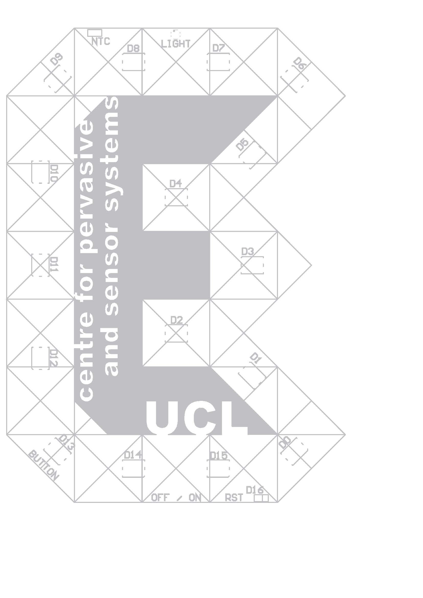

# Engduino overview 

The Engduino is just a simple, small, computer that is capable of measuring quite a lot of interesting things about the real world and that has a bunch of LEDs that can be used to provide feedback to the user. This booklet contains a series of challenges that you can use to get to know some of the features of your Engduino. Before you make a start you should complete the Traffic Lights Exercise.

For those who know about these things, the Engduino is, at heart, an Arduino (just a brand of simple computer). Your Engduino board comes pre-fitted with some sensors and LEDs so we can get straight into experimenting with programming the board without needing to do any construction beforehand.

|  |  |
|-----|------|
| Top | Bottom |

Figure 1: The top and bottom of your Engduino

On the one side of your Engduino you have 16 LED lights that have adjustable brightness and can be set to various mixtures of the three primary colours (of light): Red, Green and Blue.
 

Figure 2:  16 Red, Green, Blue LEDs on one side of the board

 

# Schematic 
The LEDS are numbered 0 – 15 and their exact positions can be seen below. You will need this information when you program the LEDs. 

 

# Task Sheet

## School

| Task No.  | Name                       | Sensors              |  Points | Pupils' Initials                            | Judge's Signature |  
|-----------|----------------------------|----------------------|:-------:|---------------------------------------------|-------------------|
| 1.1       | One by one                 | LEDs    		| 1       |					        |	            | 
| 1.2       | Chase around               | LEDs    		| 1       |  					        |                   |
| 1.3       | Dim the lights             | LEDs    		| 1       |					        |                   |   
| 1.4       | Make a colour              | LEDs    		| 1       |                                             |                   |   
| 1.5       | Make a flag                | LEDs    		| 1       |   				                |                   |    
| 1.6       | Make a candle              | LEDs    		| 1       |   					        |                   |    
| 1.7       | Make a light show          | LEDs            	| 1       |   					        |                   |    
| 1.8       | Make a light show          | LEDs            	| 1       |   					        |                   |    
| 1.9       | Press the button           | LEDs, Button    	| 1       |   					        |                   |    
| 1.10      | Make a torch               | LEDs, Button    	| 1       |   					        |                   |    
| 1.11      | Release the button         | LEDs, Button    	| 1       |   					        |                   |    
| 1.12      | What's the temperature?    | Thermistor           | 1       |   					        |                   |    
| 1.13      | What's light reading?      | Light Sensor         | 1       |   					        |                   |    
| 1.14      | Read the accelerometer     | Accelerometer        | 1       |   					        |                   |    
| 2.1       | Running snake              | LEDs                 | 2       |   					        |                   |    
| 2.2       | Faster and faster          | LEDs                 | 2       |   					        |                   |    
| 2.3       | Wait a while               | LEDs                 | 2       |   					        |                   |    
| 2.4       | Random LEDs                | LEDs                 | 2       |   				        	|                   |    
| 2.5       | Random colours             | LEDs                 | 2       |   				        	|                   |    
| 2.6       | Make a dice 		 | LEDs                 | 2       |   				        	|                   |    
| 3.1       | Fade out                   | LEDs                 | 3       |   				        	|                   |    
| 3.2       | Lights on                  | LEDs, Light Sensor   | 3       |   				        	|                   |    
| 3.3       | Too hot                    | LEDs, Thermistor     | 3       |   				        	|                   |    
| 3.4       | Tilt                       | LEDs, Accelerometer  | 3       |   				        	|                   |   
| 3.5       | Shake                      | LEDs, Accelerometer  | 3       |   				        	|                   ||
