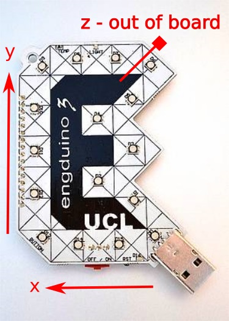




# Task 1.14: Read the accelerometer  

| Level| Maximum Points | Uses |
| ------ |:------:|------|
| Easy | 1  | Accelerometer |

## Mission

Read the values from the accelerometer and print out on serial monitor. 

## You will need
* An Engduino.
* The ** ENGDUINO LIBRARIES: THE ACCELEROMETER ** sheet.

## Method
The Engduino can measure acceleration using a device called an accelerometer. 

The acceleration that the Engduino measures could be thought of as being composed of two parts:
* Dynamic acceleration – which you get when a car accelerates, for example. Or when a human moves – any change in direction is an acceleration, so moving up and down when walking involves acceleration, and we can measure that (this is how a pedometer works).
* Acceleration (or force) – due to gravity. Even when the Engduino is on a desk, not apparently moving, it will register the force due to gravity. Since the accelerometer can tell you in which direction the force is acting, we can use this to turn the Engduino into a spirit level.

Any action that involves a change in direction – any sufficiently large vibration – can be measured with an accelerometer. Likewise, we can know whether the Engduino is face up or face down, or being turned end over end. The Engduino measures acceleration in three directions : x, y, z, like this:


1. Read the ** ENGDUINO LIBRARIES: THE ACCELEROMETER ** sheet.
2. Open a new sketch.
3. Save the sketch with a new name: ```accelerometer```.
4. Write some code to read the accelerometer and print out the values for the forces in the x, y, and z axes.
5. For an extra point, describe to the judge how to change the 'z' values to be negative.  What is happening here?


Congratulations! Collect your points for this challenge.

<!---

-->
