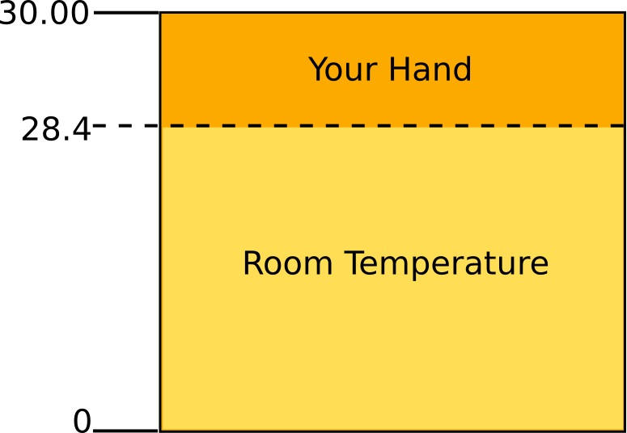



# Task 3.3: Too hot 

| Level| Points | Uses |
| ------ |:------:|------|
| Hard | 3 | LEDs, Thermistor |

## Mission
Make the LEDs light up  when you hold the heat sensor.  

Sometimes you want to do something when a sensor value is above or below a * threshold *. In this challenge you will turn some of the LEDs on when you hold the heat sensor. The heat from your hand will probably be a little bit hotter than the temperature in the room. The diagram below shows that if the temperature is below 28 degrees Celsius we are measuring the temperature in the room, the threshold may be different for you. First of all you need to measure the temperature in the room and the temperature when your finger is placed over the sensor. Use the information in the ** THERMISTOR ** sheet to work out how to do this.



## You will need
* An Engduino.
* The ** ENGDUINO LIBRARIES: THE LEDS ** sheet.
* The ** ENGDUINO LIBRARIES: THE THERMISTOR** sheet.
* The ** ENGDUINO LIBRARIES: IF STATEMENTS ** sheet.

## Method
1. Read the ** ENGDUINO LIBRARIES: THE LEDS ** sheet,  the ** THERMISTOR ** sheet and the sheet about ** IF STATEMENTS **.
3. Open a new sketch.
4. Save the sketch with a new name: ```hot```.
5. Write some code to read the value from the heat sensor and print it to the serial monitor.
6. Open the serial monitor. Can you see the temperature values being printed? 
7. Write down the value of the temperature readings and choose where you want your threshold to be.
8. Put your finger over the thermistor, write down the value of the thermistor reading.
9. Add some more code so that LEDs 13, 14, 15 and 0 come on when the light sensor value is below the threshold. You should use an ```if``` statement. 
10. Now add more code so that LEDs 6, 7, 8, and 9 come on when the light sensor value is above the threshold. 
11. Put in a short delay just before the end of the main loop and turn all the LEDs ```OFF```.


Congratulations! Collect your points for this challenge.

<!---

-->
