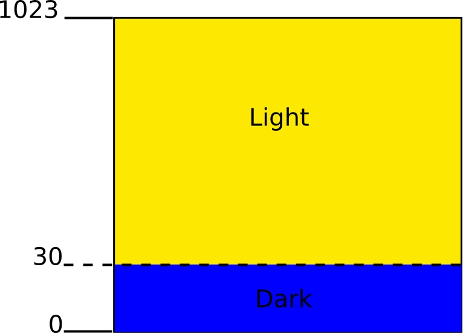



# Task 3.2: Lights on 

| Level| Points | Uses |
| ------ |:------:|------|
| Hard | 3 | LEDs, Light sensor |

## Mission
Make the LEDs light up  when it is dark.  

Sometimes you want to do something when a sensor value is above or below a * threshold *. In this challenge you will turn the LEDs on when it's  dark and we will * make * it dark by putting a finger over the light sensor.  The diagram below shows that if the light level falls below 30 it is dark although it may be different in the room where you are.  First of all you need to measure the light levels in the room and the light levels when your finger is placed over the sensor. Use the information in the ** LIGHT SENSOR ** sheet to work out how to do this.



## You will need
* An Engduino.
* The ** ENGDUINO LIBRARIES: THE LEDS ** sheet.
* The ** ENGDUINO LIBRARIES: THE LIGHT SENSOR ** sheet.
* The ** ENGDUINO LIBRARIES: IF STATEMENTS ** sheet.

## Method
1. Read the ** ENGDUINO LIBRARIES: THE LEDS ** sheet,  the ** LIGHT SENSOR ** sheet and the sheet about ** IF STATEMENTS **.
3. Open a new sketch.
4. Save the sketch with a new name: ```lightsOn```.
5. Write some code to read the value from the light sensor and print it to the serial monitor.
6. Open the serial monitor. Can you see the light sensor values being printed? 
7. Write down the value of the light sensor readings.
8. Make it dark by putting your finger over the light sensor, write down the value of the light sensor reading now.
9. Add some more code so that the LEDs come on when the light sensor value is below a certain threshold. You should use an ```if``` statement. 


Continue until you have completed the challenge.


Congratulations! Collect your points for this challenge.

<!---

-->
