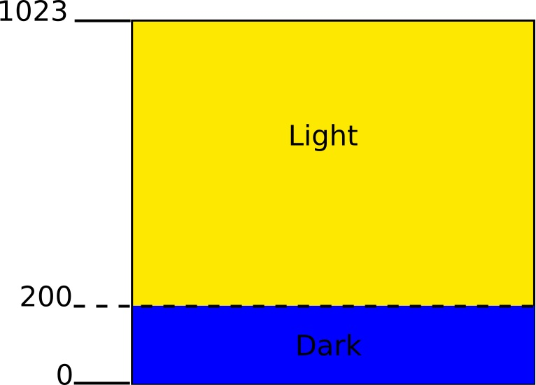



# Task: Lights on 

| Level| Maximum Points | Uses |
| ------ |:------:|------|
| Medium | 2 | LEDs, Light sensor |

## Mission
Make the LEDs light up  when it is dark.  Sometimes you want to do something when a sensor value is above or below a * threshold *. In this challenge you will turn the LEDs on when the light level goes below a certain value. 



The diagram shows that if the light level is below 30 it is dark.

First of all you need to measure the light levels in the room. Use the information in the ** LIGHT SENSOR ** sheet to work out how to do this.

## You will need
* An Engduino.
* The ** ENGDUINO LIBRARIES: THE LEDS ** sheet.
* The ** ENGDUINO LIBRARIES: THE LIGHT SENSOR ** sheet.
* The ** ENGDUINO LIBRARIES: IF STATEMENTS ** sheet.

## Method
1. Read the ** ENGDUINO LIBRARIES: THE LEDS ** sheet,  the ** LIGHT SENSOR ** sheet and the sheet about ** IF STATEMENTS **.
3. Open a new sketch.
4. Save the sketch with a new name: ```lightsOn```.
6. Write down the value of the light sensor reading, use the table below.
7. Make it dark by putting your finger over the light sensor, write down the value of the light sensor reading now.


	| Normal | Finger over light sensor| Threshold |
	| ------ |------|------|
	| | | | 

7. Add some more code so that the LEDs come on when the light sensor value is below a certain threshold. 

	Choose a light sensor value that is close to  the value you noted when you put your finger over the sensor and write it in the table above. 

8. 
	```
	int b =  15; // This is the brightness level.

	```
6. In the main loop, set the LEDs to any colour you like with the brightness level set to ```b```.
7. Subtract 1 from b like this:
	```b = b - 1;```
8. Add a delay of half a second. 
9. For an extra 2 points, reset ```b``` to 15 every time it reaches ```0```. Hint: use an ```if``` statement. 
10. Remember to ask one of the judges if you need help.


Continue until you have completed the challenge.


Congratulations! go and collect your points for this challenge.

<!---

-->
