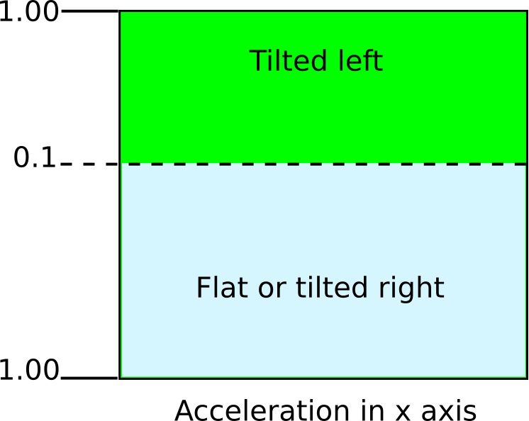



# Task 3.4: Tilt 

| Level| Points | Uses |
| ------ |:------:|------|
| Hard | 3 | LEDs, Accelerometer|

## Mission
Make the LEDs light up  when you tilt the Engduino from side-to-side.  

Sometimes you want to do something when a sensor value is above or below a * threshold *. In this challenge you will turn some of the LEDs on when you tilt the Engduino from side to side. First you need to measure the acceleration values when the board is flat and then you need to see what happens when you tilt the board. Use the information in the ** ACCELEROMETER ** sheet to work out how to do this.



## You will need
* An Engduino.
* The ** ENGDUINO LIBRARIES: THE LEDS ** sheet.
* The ** ENGDUINO LIBRARIES: ACCELEROMETER ** sheet.
* The ** ENGDUINO LIBRARIES: IF STATEMENTS ** sheet.

## Method
1. Read the ** ENGDUINO LIBRARIES: THE LEDS ** sheet,  the ** ACCELEROMETER ** sheet and the sheet about ** IF STATEMENTS **.
3. Open a new sketch.
4. Save the sketch with a new name: ```tilt```.
5. Write some code to read the acceleration in the x axis and print it to the serial monitor.
6. Open the serial monitor. Can you see the accelerometer values being printed? 
7. Write down the value of the accelerometer readings when the device is flat on the table.
8. Tilt the Engduino to the left. What is the accelerometer reading now?  Decide where you want your threshold to be.
9. Add some more code so that the LEDs on the left side of the board come on when the accelerometer value reaches the threshold. You should use an ```if``` statement. 
10. You will need another threshold for the right tilt. Tilt the Engduino to the right, what is the accelerometer reading now?  Decide where you want the new threshold to be.
11. Now add more code so that the LEDs on the right side come on when the accelerometer value is above the new threshold. 
12. Put in a short delay just before the end of the main loop and turn all the LEDs ```OFF```.


Congratulations! Collect your points for this challenge.

<!---

-->
