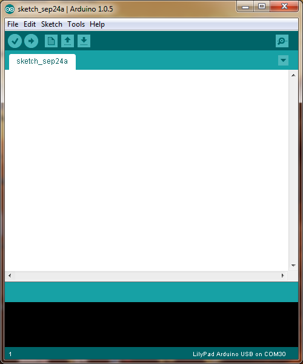

# Traffic Lights

## Introduction
The Engduino is just a simple, small, computer that is capable of measuring quite a lot of interesting things about the real world and that has a bunch of LEDs that can be used to provide feedback to the user. This is a step-by-step guide to creating a very simple program and watching that run. 

## Overview of the Engduino Board
For those who know about these things, the Engduino is, at heart, an Arduino (just a brand of simple computer). Your Engduino board comes pre-fitted with some sensors and LEDs so we can get straight into experimenting with programming the board without needing to do any construction beforehand.

Figure 1: The top and bottom of your Engduino
 

On the one side of your Engduino you have 16 LED lights that have adjustable brightness and can be set to various mixtures of the three primary colours (of light): Red, Green and Blue.
 

Figure 2:  16 Red, Green, Blue LEDs on one side of the board

The LEDS are numbered 0 – 15 and their exact positions can be seen in ???. Also on this side of the board we have a thermistor which can be used to detect temperature and a light sensor. On the other side we have a battery holder where we can install a battery. 

## Your first app
For your first exercise you are going to write a program in your Arduino IDE and then upload it to your Engduino board. If this is a lab class, your Arduino IDE should be open for you already. If not, just double click on the blue Arduino icon on your computer. You should see a window like that shown below:

