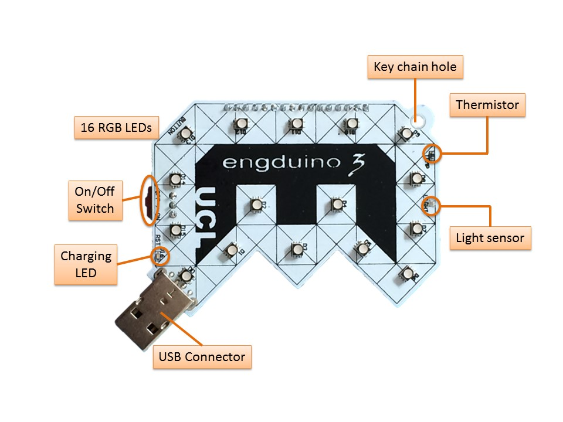
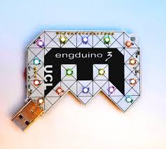

# Traffic Lights

## Introduction
The Engduino is just a simple, small, computer that is capable of measuring quite a lot of interesting things about the real world and that has a bunch of LEDs that can be used to provide feedback to the user. This is a step-by-step guide to creating a very simple program and watching that run. 


## Overview of the Engduino board
For those who know about these things, the Engduino is, at heart, an Arduino (just a brand of simple computer). Your Engduino board comes pre-fitted with some sensors and LEDs so we can get straight into experimenting with programming the board without needing to do any construction beforehand.


|  | |
|---|---|
| Top | Bottom |


Figure 1: The top and bottom of your Engduino
 

On the one side of your Engduino you have 16 LED lights that have adjustable brightness and can be set to various mixtures of the three primary colours (of light): Red, Green and Blue.
 




Figure 2:  16 Red, Green, Blue LEDs on one side of the board


The LEDS are numbered 0 – 15 and their exact positions can be seen in ???. Also on this side of the board we have a thermistor which can be used to detect temperature and a light sensor. On the other side we have a battery holder where we can install a battery. 

## Your first app
For your first exercise you are going to write a program in your Arduino IDE and then upload it to your Engduino board. If this is a lab class, your Arduino IDE should be open for you already. If not, just double click on the blue Arduino icon on your computer. You should see a window like that shown below:


Now we’re going to write a program. Type the following into the white box. Try to type as accurately as you can. Notice that ```All``` is spelt with an upper case ```A``` and lower case ```ll```.

```
#include  <EngduinoLEDs.h>

void setup()
{
  EngduinoLEDs.begin();
}


void loop()
{
  EngduinoLEDs.setAll(GREEN);
}

```
Now let’s make it run…. make sure your Engduino is plugged in. Click on the upload button:


This checks your code for some types of error, turns it into something that a machine can understand, and then uploads it to the Engduino board. If there are errors they will appear in the black section in red.

Voila – your first Engduino program.


## Looking a bit closer
Now let’s take a quick look at some interesting parts of the basic app code and see how we can customise, personalise or enhance it.

```#include  <EngduinoLEDs.h>```

This lets your program use the LEDs. If you wanted to use the button you would have change this to be ```#include <EngduinoButton.h>```, and if you wanted to use both, you would need to have both there. There is at least one ```#include``` for each of the sensors on the Engduino.

The next part of the program is:

```
void setup()
{
  EngduinoLEDs.begin();
}
```

This is a function. A function is similar to the ones you may have experienced in mathematics. It can take some value/s and returns another value after it executes. void is what the function returns (nothing in this case), then comes the function name (setup in this case) and then brackets that contain the values we pass to the function (none in this case, so the brackets are empty.) The curly brackets delimit our code, so in a file with many functions everything within the set of curly brackets just after our function name belongs to that function. Our function ```setup()``` has just one line

```EngduinoLEDs.begin();```

This line tells the EngduinoLEDs object to run the function begin(), which gets the LEDs started so we can play with them. The semi-colon at the end of the line is common to many programming languages and signals to the computer that is the end of one instruction. Don’t forget these when you start writing your own code . The setup function runs exactly once, when the program starts.
The next function:
```
void loop()
{
  EngduinoLEDs.setAll(GREEN);
}
```

is called ```loop()```. The loop function is run repeatedly – and it’s where we put most of the instructions we want our Engduino to perform. In this case, it’s just one thing: ```EngduinoLEDs.setAll(GREEN);```

This line tells the ```EngduinoLEDs``` object to execute the function ```setAll()```. We pass this function a value, namely what colour to make the LEDs (green in this case). It doesn’t return a value but simply does what you tell it, and switches the LEDs on.
This line will actually be executed over and over as fast as the Engduino can go  – but since it always does the same thing, you won’t see any change.
Personalise your a


